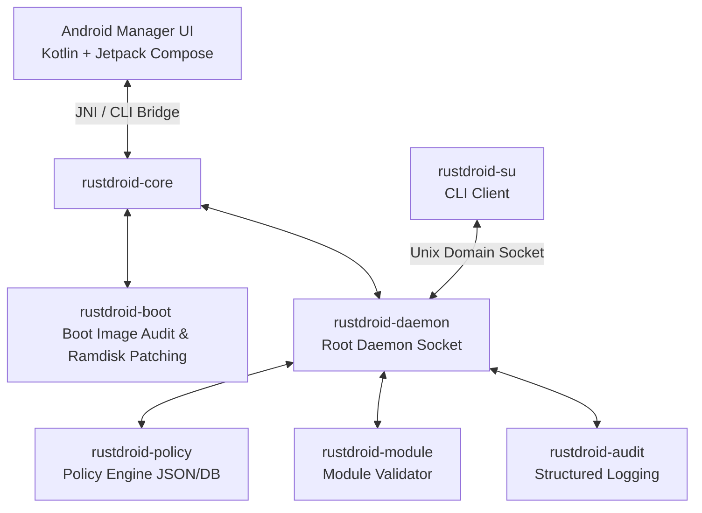

# RustDroid

An open-source Android root manager framework designed with a Rust-first core and a Jetpack Compose management interface.

---

## What is RustDroid?

RustDroid combines a memory-safe Rust core with an Android Manager UI to manage device compatibility, offline boot image patching, and safe userspace root orchestration. By placing critical components like ramdisk parsing, IPC framing, policy storage, and security auditing in Rust, the project aims to minimize risks inherent in low-level Android system tools.

*   **Rust Core**: Handles high-performance, memory-safe abstractions for boot image dissection (v0-v4), Gzip/LZ4 ramdisk round-trips, IPC frame serialization, and audit logging.
*   **Android Manager**: A Compose-based UI that calls native Rust APIs via a JNI bridge to show device information, dry-run module status, verification logs, and safety matrices.

---

## How It Works

RustDroid separates concerns between the privileged daemon, the CLI su tool, and the user-facing Android Manager UI:



1.  **Boot Patching**: `rustdroid-boot` plans, decompresses, audits, and patches boot/init_boot ramdisks offline.
2.  **Privileged IPC**: The `rustdroidd` daemon listens on a secure Unix domain socket, verifying client credentials (UID/PID/SELinux context via `SO_PEERCRED`).
3.  **Command Execution**: Authorized commands execute under a sanitized child environment with strict SIGKILL timeouts and output limits.
4.  **Module Auditing**: User-supplied module ZIPs are statically scanned and dry-run validated prior to registration. No arbitrary execution or system mounting is performed.

---

## Safety Scope & Non-Goals

RustDroid enforces a conservative, transparent, and auditable safety boundary. It is **NOT** a stealth tool.

*   **No Attestation/Root Bypasses**: Does not implement Play Integrity bypass, banking app evasion, anti-cheat evasion, or attestation manipulation.
*   **No Stealth/Hiding**: Does not support root hiding, process hiding, file hiding, kprobe hiding, or syscall interception/hiding.
*   **No Auto-Flashing/Rebooting**: Never modifies boot partitions directly, writes to raw block devices, or reboots devices automatically.
*   **Disabled Actions in Current Version**: Direct filesystem bind mounts and module script execution are disabled via compile-time guards. Only static analysis and dry-run plans are generated.

---

## Repository Structure

```
.
├── manager/android/     # Kotlin/Compose Android Manager application
├── rust/                # Core Rust Workspace
│   └── crates/
│       ├── rustdroid-core/    # Public API orchestrator and JNI exports
│       ├── rustdroid-boot/    # Boot/init_boot.img parser and patcher
│       ├── rustdroid-daemon/  # Privileged daemon (rustdroidd)
│       ├── rustdroid-su/      # CLI client (su)
│       ├── rustdroid-policy/  # Policy rules database (policy.json)
│       ├── rustdroid-module/  # Module validator and layout manager
│       ├── rustdroid-mount/   # Namespace mount abstractions (disabled in v1.4+)
│       ├── rustdroid-audit/   # Audit logger (su.log, daemon.log, etc.)
│       └── rustdroid-common/  # Shared models, constants, and IPC protocols
├── c/                   # Low-level Native Compatibility Glue (POSIX/SELinux)
├── assets/              # Init scripts, sepolicy configurations, module templates
└── scripts/             # Development, scan, and validation automation
```

---

## Build from Source

### 1. Prerequisites
- Rust (stable compiler, `aarch64-linux-android` target support)
- Java JDK 17
- Android SDK & NDK (cmake toolchain)

### 2. Compile Rust Core
To compile the workspace crates for the host system (tests and dry-runs):
```bash
./scripts/build-rust.sh host
```

To compile for Android ARM64 target (requires `ANDROID_NDK_HOME` to be set):
```bash
./scripts/build-rust.sh --target android-arm64
```

### 3. Build Android Manager APK
Compile the management interface from the `manager/android` directory using the Gradle wrapper:
```bash
cd manager/android
./gradlew assembleDebug
```

---

## GitHub Actions APK Build

The project includes an automated GitHub Actions CI pipeline configured in `.github/workflows/build-apk.yml`. 

On every push, pull request, or manual trigger (`workflow_dispatch`), the workflow:
1.  Sets up JDK 17 (Temurin) and caches Gradle dependencies.
2.  Sets up the stable Rust environment.
3.  Runs the cargo test suite (`cargo test --workspace`).
4.  Executes the static security code scanner (`scripts/security-scan.sh`).
5.  Builds the Android Manager debug APK.
6.  Uploads the compiled debug APK as an Actions artifact.

---

## Development Status

This repository is currently in an active development phase. Features such as boot patching, IPC sockets, JNI bindings, and dry-run script validation are functional and covered by testing suites. Low-level mounting and automated execution script flows are compiled out or disabled in the safety scope.

---

## Safety Disclaimer

> [!CAUTION]  
> **Use at Your Own Risk.**  
> RustDroid is experimental software. Modifying boot images and manipulating Android privilege levels can cause bootloops, data loss, or device bricking. Always ensure you have a stock boot image backup and an unlocked bootloader to restore your device.
