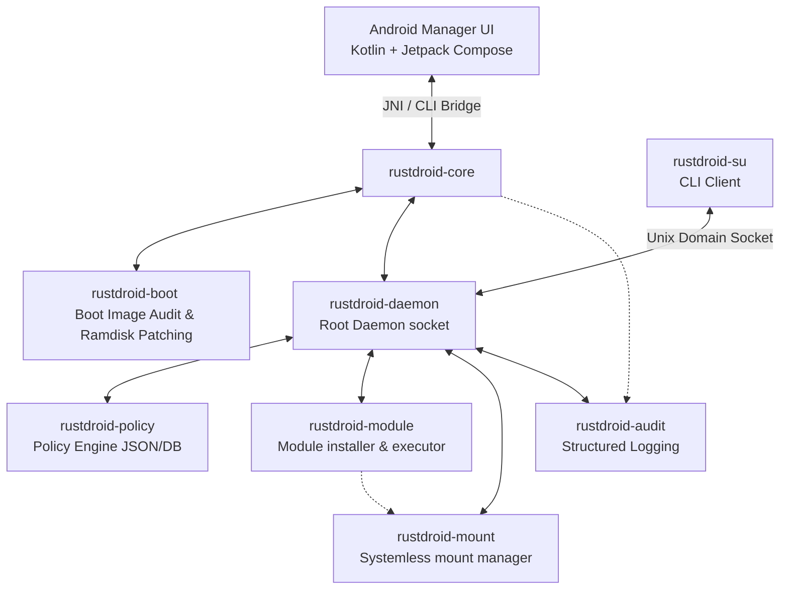

# RustDroid

RustDroid is an open-source Android root manager for user-owned devices, inspired by the general architecture of Magisk-style boot image patching and root permission management, but designed and implemented with a Rust-first core.

> [!WARNING]  
> **Important Safety & Compliance Scope**  
> * RustDroid is **NOT** a bypass or stealth tool.  
> * This project **does NOT** implement Play Integrity bypasses, banking app bypasses, anti-cheat evasion, root hiding, process/file/kprobe hiding, syscall interception, attestation manipulation, or any stealth behavior.  
> * RustDroid is dedicated solely to transparent, auditable, and legitimate root management for user-owned devices. This includes safe boot image patching, a robust root daemon, granular su permission management, a clean module system, and bootloop/safe-mode protections.

---

## Architecture Overview



RustDroid is structured to separate concerns cleanly, keeping the Android UI thin and placing all critical root orchestration, patching, and policy logic in Rust. C is strictly confined to low-level compatibility layers.

### Repository Layout

```
RustDroid/
├── README.md                 # Main project overview and roadmap
│
├── manager/                  # Android Manager application
│   └── android/
│       ├── app/              # Jetpack Compose UI
│       ├── build.gradle.kts  # Gradle build configuration
│       ├── settings.gradle.kts
│       └── README.md         # Manager documentation
│
├── rust/                     # Core Rust Implementation
│   ├── Cargo.toml            # Cargo workspace
│   ├── README.md             # Rust workspace overview
│   └── crates/
│       ├── rustdroid-core/    # Public APIs, UI Orchestrator
│       ├── rustdroid-boot/    # Boot/init_boot.img parser and patcher
│       ├── rustdroid-daemon/  # /system/bin/rustdroidd (daemon)
│       ├── rustdroid-su/      # /system/xbin/su (CLI client)
│       ├── rustdroid-policy/  # Policy Engine (Permissions storage)
│       ├── rustdroid-module/  # Module manager (post-fs-data, services)
│       ├── rustdroid-mount/   # Systemless bind mounts
│       ├── rustdroid-audit/   # Audit logger
│       └── rustdroid-common/  # Shared models, constants, and protocols
│
├── c/                        # Low-level Native Compatibility Glue
│   ├── CMakeLists.txt        # Native library build script
│   ├── README.md             # C Glue documentation
│   ├── include/
│   │   └── rustdroid_c.h     # Native FFI headers for Rust
│   └── src/
│       ├── android_glue.c    # Android specific APIs
│       ├── mount_glue.c      # Mount and pivot_root compatibility
│       ├── selinux_glue.c    # SELinux context helper functions
│       └── process_glue.c    # Process credentials and sessions
│
├── assets/                   # Non-code assets
│   ├── init.rustdroid.rc     # Init configurations for the daemon
│   ├── module_template/      # Skeleton for custom RustDroid modules
│   └── sepolicy/             # SELinux policy configurations
│
└── scripts/                  # Automation scripts
    ├── build-rust.sh         # Builds the Rust crates for Android targets
    ├── build-c.sh            # Builds C native glue libraries
    ├── build-android.sh      # Compiles the Kotlin manager application
    ├── package.sh            # Packages binaries and patches for flashing
    └── test-boot-patch.sh    # Audits and tests the boot patch flow locally
```

---

## Component Requirements & Design

### 1. Android Manager UI (`/manager/android/`)
* **Technology**: Kotlin + Jetpack Compose.
* **Goal**: Maintain a super-thin UI. It serves as a visual bridge for the user to:
  * Select and audit a `boot.img` or `init_boot.img`.
  * Trigger image patching via `rustdroid-core` using JNI.
  * Review root status and toggle per-app permissions.
  * Install and toggle modules.
  * Read audit logs (`su.log`, `daemon.log`, `module.log`, `patch.log`).
* **Design Philosophy**: Core logic resides entirely in Rust. The Kotlin code simply calls into Rust APIs or passes commands to a CLI bridge.

### 2. Rust Workspace (`/rust/`)
Implemented in safe, idiomatic Rust. Panics are strictly avoided in critical execution paths, favoring comprehensive error propagation (`Result<T, E>`).

* **`rustdroid-core`**: The main interface for the JNI wrapper and orchestrator. It ties the other modules together under a clean public API.
* **`rustdroid-boot`**: Parses and validates boot image headers (versions v0 through v4). It identifies the ramdisk compressor (`gzip`, `lz4`, `lz4_legacy`), unpacks it, injects the `init.rustdroid.rc` service and binaries, and repacks it securely. It enforces a strict **fail-safe policy**: it will never patch an invalid or already patched image unless explicitly requested.
* **`rustdroid-daemon`**: The central privileged process. It starts via `init` during boot, listens on a secure Unix domain socket, identifies the caller's credentials (UID, PID, context), queries the policy engine, and decides whether to authorize root actions.
* **`rustdroid-su`**: The replacement `su` binary. It sends caller context to the daemon via the domain socket, awaits the authorization decision, and executes the target shell or command upon authorization.
* **`rustdroid-policy`**: A fast, local policy store using structured format (`JSON` or `SQLite` for MVP) located under `/data/adb/rustdroid/policy.json`. It maps package identities/UIDs to permissions (`allow`, `deny`, `ask`), with support for temporary sessions or permanent approvals.
* **`rustdroid-module`**: Manages systemless expansion. It installs, parses, and validates `module.zip` structures. It executes `post-fs-data.sh` and `service.sh` shell scripts and ensures robust **bootloop protection**.
* **`rustdroid-mount`**: Handles the mounting system. Leverages systemless bind mounts and overlays, using C compatibility glue where system-level compatibility is needed.
* **`rustdroid-audit`**: The security audit log engine. It records occurrences to specific logfiles:
  * `/data/adb/rustdroid/logs/su.log`
  * `/data/adb/rustdroid/logs/daemon.log`
  * `/data/adb/rustdroid/logs/module.log`
  * `/data/adb/rustdroid/logs/patch.log`
* **`rustdroid-common`**: Defines workspace-wide constants, protocol schemas, and common error definitions.

### 3. C Glue Layer (`/c/`)
* C is restricted strictly to low-level APIs that Rust cannot easily interface with, such as fine-grained SELinux context transitions, mount namespace operations, and platform-specific POSIX compatibility.
* Exposes FFI-safe C APIs using standard types. No business logic is written in C.

---

## MVP Roadmap

- [x] **v0.1: Initial Layout & Core Verification**
  - Setup workspace structure and basic gradle shells.
  - Implement full boot image header auditing in `rustdroid-boot` (read-only verification).
- [x] **v0.2: Ramdisk Manipulation & Patcher Foundation**
  - Implemented high-fidelity Android boot headers parsing v0-v4 (detecting `boot.img` vs `init_boot.img`).
  - Added compression magic signature detection (Gzip, LZ4, Legacy LZ4) and CPIO validation.
  - Engineered an atomic patch planning layer (`PatchPlan`) verifying file sizes and bounds before writes.
  - Implemented `RUSTDROIDV02` signature marker injection and automated JSON audit report generation.
- [x] **v0.3: Daemon & su Loop (IPC Foundation)**
  - Engineered versioned (`RUSTDROID_IPC_VERSION = 1`) Socket IPC over Unix domain socket.
  - Implemented secure length-prefixed JSON message framing (`write_prefixed_message` / `read_prefixed_message`) with oversized message rejection.
  - Integrated read-only FFI SELinux process context audits and dry-run gated execution flags.
  - Added dynamic base directories resolution (`get_data_dir()`) allowing isolated host-side sandbox tests.
- [x] **v0.4: Policy + Android Manager Bridge Foundation**
  - Hardened Unix domain socket security with `SO_PEERCRED` verified peer credential (UID/PID/GID) validation.
  - Restricted Android UID 1000 auto-allow behavior strictly to dry-run/mock environments, enforcing stored policies for real-device system callers.
  - Implemented thread-safe privilege daemon pending permission requests queue blocking su clients up to 30 seconds.
  - Built `rustdroid-policy` supporting persistent, transient, and timed policy rules (`Once`, `UntilReboot`, `ForDuration`, `Always`).
  - Engineered atomic same-directory saves in policy JSON database.
  - Orchestrated `rustdroid-core` stubs returning schema-safe JSON strings for thin JNI/Kotlin Android UI integrations.
  - Constructed a premium Jetpack Compose Android UI displaying root status, pending authorizations lists, policy rules, and audit logs.
  - Added robust unit and concurrent Unix socket integration test suites validating credentials isolation and timeouts.
- [x] **v0.5: Real Command Execution Foundation**
  - Gated execution paths strictly under verified caller identities and explicit policy consent.
  - Supported minimal, sanitized child processes execution environment (`PATH=/system/bin:/system/xbin:/vendor/bin`, `HOME=/`, `RUSTDROID=1`).
  - Built a command execution broker implementing strict process runtime monitoring, output limit caps, and SIGKILL timeout enforcement.
  - Added CLI client command flags (`--execute`, `--dry-run`, `--command`, `--json`, `--debug-json`) defaulting safely to dry-run mode.
  - Leveraged automated session ID redaction in normal JSON outputs, exposing complete tokens only when `--debug-json` is explicitly requested.
  - Enforced redacting in normal audit logs to securely document basename and argument counts only, protecting sensitive payload details.
- [x] **v0.6: Android Boot Integration Packaging Foundation**
  - Staged automated cross-compilation pipeline targeting standard Android ABIs (`aarch64-linux-android`) using standard LLVM NDK toolchains.
  - Standardized automated packaging pipeline staging assets, binary payloads, and dynamic JSON package metadata reports in the `out/rustdroid_payload/` folder.
  - Configured and validated static `init.rustdroid.rc` service configuration mapping the daemon in privileged context without bypassing Android security models.
  - Built a payload injection planner with strict path validation rules that automatically checks for path traversals (`..`) and absolute paths in ramdisk root, keeping real-device injections fully conservative.
  - Updated main workspace documentation clarifying layout specifications and safety limits.
- [x] **v0.7: Real Ramdisk Injection/Repack Foundation**
  - Engineered high-performance, pure Rust SVR4 newc CPIO parser and writer supporting regular files, directories, modes, permissions, and correct 4-byte padding alignments.
  - Support robust decompress/recompress round-trip for Gzip ramdisks using safe pure Rust `flate2` integrations.
  - Restructured `init.rustdroid.rc` staging assertions triggering startup on `post-fs-data` after persistence storage is decrypted and ready.
  - Integrated automated SHA-256 payload manifest generation, staging modes, and size metrics in `metadata.json`.
  - Added strict ELF executable and AArch64 architecture validation checks in `package.sh` compile steps.
  - Injected minimal RustDroid boot assets (`init.rustdroid.rc`, `rustdroid/.installed`, `rustdroid/version`, `rustdroid/payload_manifest.json`) in ramdisk archive.
  - Engineered conservative `init.rc` import injection preventing duplicate imports or modification of unrelated system behaviors.
  - Produced comprehensive JSON `PatchReport` auditing files modified, CPIO record counts, and safety limits.
  - Enforced atomic output writes in the same directory using `.tmp` buffers, keeping input boot images entirely unmodified.

- [x] **v0.8: On-Device ADB Validation Foundation**
  - Designed safe, offline, ADB-based userspace validation workflow in `scripts/adb-validate.sh` preventing flashing or reboot operations.
  - Implemented manual self-checks (`--self-check`) inside su and daemon binaries to audit architectures and safety scopes.
  - Built post-patch verification routine checking files, imports, and safety bounds.
  - Added test suites ensuring paths safety and blocking of flash-related commands.
- [x] **v0.9a: LZ4 and LZ4 Legacy Ramdisk Round-Trip Support**
  - Extended `rustdroid-boot` ramdisk handling to support standard LZ4 frame and LZ4 Legacy frame/block formats.
  - Implemented automatic compression family preservation (LZ4 remains standard LZ4, LZ4 Legacy remains LZ4 Legacy) and refused unknown formats.
  - Added robust validation verifying decompressed CPIO validity and ensuring recompressed output is decompressed identically.
  - Extended verification routine to check that injected files exist, safety scopes are intact, and forbidden strings are absent.
  - Integrated LZ4/LZ4 Legacy support into host-side and device-side CLI (`audit`, `plan`, `patch`, `verify`) printing compression details.
- [x] **v0.9b: Controlled Real Boot Validation Materials**
  - Created a safe validation framework (`scripts/boot-validation-checklist.sh`) for manually testing patched images on an unlocked physical test device or controlled Android emulator.
  - Generates comprehensive checklists, reports (`device_assumptions.json`, `artifact_report.json`, `safety_scope.json`), rollback plans (`rollback_plan.txt`), and manual verification commands (`manual_test_plan.txt`).
  - Guarantees **no automatic flashing or rebooting** of the device, modifying no boot partitions.
  - Restricts cloud-rooted phone validation (which can only validate userspace binaries and offline boot patching, not real-boot integrations).
  - Documents risks, warning that real boot validation is highly device-specific and requires an unlocked test device or controlled emulator.
- [x] **v1.0-alpha: Runtime Install Layout & First-Boot Log Collection**
  - Implemented a safe runtime initialization routine creating the layout `/data/adb/rustdroid/` with strict directory/file modes (`0700` for data/logs/modules/run/policy/state, `0755` for bin, `0644` for config.json).
  - Maintained `install_state.json` track metadata and `config.json` containing default disabled properties (`execution_enabled: false`, `module_mounting_enabled: false`).
  - Added secure first-boot log collector logging start timestamps, identity properties, loaded configurations, and socket metadata without exposing sensitive inputs.
  - Implemented extended daemon self-checks (`rustdroidd --self-check [--json]`) and client self-checks (`su --self-check [--json]`) auditing architecture and safety limits.
  - Created a user-triggered post-boot validation script (`scripts/post-boot-validate.sh`) and report generator (`generate-report`) compiling `post_boot_report.json` offline or via adb shell.
  - Ensured **no automatic flashing or rebooting** of the device, modifying no boot partitions.
  - Excluded module mounting, attestation bypasses, and root hiding capabilities (all default safely to false/disabled).
- [x] **v1.1: Android Manager UI Integration with Miuix**
  - Connected the Kotlin Compose UI to Rust core via JNI dynamically.
  - Implemented MIUI/HyperOS style widgets using Miuix libraries.
  - Displayed device assumptions, rollback plans, and logs in user-friendly formats.
- [x] **v1.2: Module Installer Foundation without Mounting**
  - Implemented safe module ZIP structure validation, path traversal (Zip Slip) checks, and sanitization of module IDs.
  - Scanned extracted module content for security boundaries, rejecting forbidden strings (e.g. `setenforce`, `reboot`, `attestation`, `/dev/block`).
  - Staged atomic updates for `module.json` and `state.json` records.
  - Handled safe mode via `/data/adb/rustdroid/disable_modules` emergency rescue flag.
  - Integrated Miuix UI Modules screen displaying installed modules, status toggles, badges, and mounting limitations.
  - Enforced no automatic script execution, no block device writing, and no file mounting.
- [x] **v1.3: Module Script Dry-Run Validator**
  - Added safe static/dry-run validator for module scripts (`post-fs-data.sh`, `service.sh`, `customize.sh`, `uninstall.sh`) that does not execute scripts, mount files, or modify system partitions.
  - Implemented script classification to detect comments, echoes, file reads/writes, properties reads/sets, and network/reboot/mount/SELinux/block-device modification attempts.
  - Enforced strict reject pattern criteria (hard reject for `setenforce`, `supolicy`, `/dev/block`, `reboot`, `fastboot`, `pivot_root`, `mount -o bind`, `insmod`, `kprobe`, `syscall`, `attestation`, `play integrity`, `root hiding`, etc.) and warning patterns for `chmod`, `chown`, `setprop`, `app_process`, `sh -c`, `curl`, `wget`, etc.
  - Automatically generates a detailed JSON plan (`script_dry_run_plan.json`) stored under `/data/adb/rustdroid/modules/<module_id>/`.
  - Exposed manager-facing JSON APIs (`validate_module_scripts`, `get_module_script_plan`, `list_module_scripts`) via NativeBridge and JNI.
  - Extended the CLI (`rustdroid-core-cli`) with `validate-module-scripts`, `script-plan`, and `list-module-scripts` subcommands.
  - Integrated Miuix Modules screen UI with badge states, a "Validate scripts" button calling NativeBridge, and a banner clarifying that scripts are not executed.
- [x] **v1.4: UI Polish, Security Hardening, and C Glue Audit**
  - Added Security Center dashboard tab: centralized view of all security constraints with SELinux status, dangerous capabilities (all DISABLED), static safety scan results, and safety scope summary.
  - Added C Glue Audit tab: per-file safety status (android_glue=SAFE, mount_glue=DISABLED, selinux_glue=READ-ONLY, process_glue=RESTRICTED) and forbidden symbol verification (setenforce, pivot_root, system(), popen(), execve, reboot, fastboot, /dev/block).
  - Created `scripts/security-scan.sh`: static security scanner checking 16 forbidden patterns across the full codebase, with context-aware allowlists for safety documentation, test fixtures, and pattern-definition arrays.
  - Hardened all C glue files (`android_glue.c`, `mount_glue.c`, `selinux_glue.c`, `process_glue.c`) with comprehensive safety documentation, parameter validation, and explicit forbidden-operation lists.
  - Disabled mount operations via `RUSTDROID_V14_MOUNT_DISABLED` compile guard — `rustdroid_c_bind_mount()` always returns -1/ENOSYS in v1.4.
  - Extended Rust core (`rustdroid-core`) with 6 new JSON APIs: `get_security_status()`, `get_c_glue_audit()`, `get_static_safety_report()`, `get_ui_safety_scope()`, `get_redaction_policy()`, `validate_native_bridge_state()`.
  - Added command-line redaction helper (`redact_command_line`) and timestamp helper (`format_timestamp_secs`).
  - Added 6 new JNI exports and corresponding `NativeBridge.kt` Kotlin wrappers with mock fallbacks.
  - Improved Dashboard tab with safety badges, version info, and bridge status.
  - Improved Logs tab with filter chips for 5 log files and redaction indicator badge.
  - Improved Modules tab with explicit mounting/execution limitation warnings and status badges.
  - Added mock mode banner displaying prominently when no real daemon is connected.
  - Added 11 new Rust tests verifying all v1.4 security APIs, malformed JSON rejection, redaction behavior, and mock mode safety.
  - Updated `rustdroid_c.h`, `c/README.md`, and `manager/android/README.md` with v1.4 audit documentation.
  - Rust workspace builds with zero warnings. All 11 v1.4 tests pass. Security scanner reports CLEAN.


---

## Deployment & Staging Layout

### 1. Generated Package Directory Layout (`out/rustdroid_payload/`)
When compiling and staging files using `./scripts/package.sh`, the packaging tool consolidates assets under:
```
out/rustdroid_payload/
├── bin/
│   ├── rustdroidd             # Privileged cross-compiled daemon binary
│   └── su                     # Cross-compiled su IPC client binary
├── init/
│   └── init.rustdroid.rc      # Android init service definition
├── module_template/           # Asset skeleton for systemless modules staging
├── sepolicy/                  # SELinux policy addition templates
└── metadata.json              # Dynamic JSON metadata report of the staged build
```

### 2. Runtime Filesystem Layout (`/data/adb/rustdroid/`)
Once staged or installed onto the target Android device's persistent root area:
```
/data/adb/rustdroid/
├── bin/
│   ├── rustdroidd             # Staged privileged daemon
│   └── su                     # Client executable symlinked or placed in PATH
├── logs/                      # Secure auditing log directory (su.log, daemon.log)
├── modules/                   # Stored systemless user modules
├── run/                       # Temp runtime socket files and lock storage
├── policy.json                # Stored policy database (JSON DB version 2)
└── config.json                # Daemon configuration options
```

---

### What is Supported in v1.4:
- **Security Center Dashboard**: Centralized UI tab showing SELinux status, dangerous capabilities (all DISABLED), static safety scan results, and safety scope summary.
- **C Glue Audit Screen**: Per-file audit status (SAFE/DISABLED/READ-ONLY/RESTRICTED), forbidden symbol verification across all C sources.
- **Static Security Scanner**: `scripts/security-scan.sh` checks 16 forbidden patterns across the full codebase with context-aware allowlists.
- **Redaction Policy**: Session tokens redacted to first 4 chars, commands redacted to basename + arg count, logs redacted by default.
- **C Glue Hardening**: All C files audited with comprehensive safety documentation, mount operations disabled via compile guard.
- **Module Script Static Dry-Run Validator**: Dry-run parses and classifies script lines statically, identifying comments, property operations, process/system controls, and filesystem operations without executing scripts, sourcing files, or running shells.
- **Dry-Run Execution Plan**: Automatically outputs JSON plans (`script_dry_run_plan.json`) detailing hard errors, warnings, classified actions, stages ordering, and sets `safe_to_execute_later` strictly to false if hard errors exist.
- **Manager and CLI APIs**: Core manager JSON APIs and CLI endpoints expose script listing, validation reports, and dry-run planning schemas.
- **Miuix UI Integration Screen**: Premium Modules screen tab displays script validation badge states (No scripts, Valid dry-run, Warnings, Rejected), lists classified actions, warnings, hard errors, and provides a "Validate scripts" action button.
- **Module ZIP Validation**: Full validation of module ZIP structure, sanitizing module IDs to prevent paths with traversals or traversal patterns, refusing symlinks/special files, and scanning contents for forbidden commands (e.g. `setenforce`, `reboot`, `attestation`, `/dev/block`).
- **Module Installer Foundation**: Extracting validated module files securely under `/data/adb/rustdroid/modules/<module_id>/`, writing state records atomically to `module.json` and `state.json`.
- **Module State Management**: Formatted APIs to list, get, enable, disable, and remove modules with safe mode (Emergency Rescue `/data/adb/rustdroid/disable_modules` flag) handling.
- **Miuix Android Manager UI Integration**: Connected the Kotlin Compose UI to Rust core via a thin JSON dynamic JNI bridge, featuring a clean MIUI/HyperOS-inspired component styling (rounded cards, preference rows, logs tail, and checklist screens).
- **JSON-Based Dynamic JNI Bridge**: All core manager interfaces (`com.rustdroid.manager.NativeBridge`) pass type-safe, auditable, and easily parsed JSON strings between Kotlin and Rust, protecting boundaries and avoiding complexity.
- **Ramdisk Round-trip Compression**: v0.9a/v1.0 supports **RawCpio**, **Gzip**, **LZ4**, and **LZ4 Legacy** ramdisk round-trips, preserving original compression families.
- **Compression Refusals**: Unknown compression formats are never patched. If a compression format cannot be safely decompressed/recompressed, a structured error is returned.
- Fully automated cross-compilation of standard workspace crates for Android targets using standard LLVM NDK linkers.
- Automated layout building and metadata reporting compiling safety scope constants.
- Automated payload injection planner that checks safety bounds before generating injection proposals.
- Clean integration unit tests for both packaging layout verification and `init.rustdroid.rc` syntax validation.
- Clean, auditable, legitimate Unix domain socket credentials verification.
- Safe ADB-based validation workflow for rooted Android devices verifying userspace binaries and offline boot patching only.

### What is NOT Supported (Strict Boundaries):
- **No Attestation/Root Bypasses**: This is not a bypass tool. It does not implement Play Integrity bypass, banking app evasion, anti-cheat evasion, or attestation manipulation.
- **No Process/File Hiding**: No pivot_root, root hiding, process hiding, file hiding, kprobe hiding, or syscall hiding are supported.
- **No exploit-based privilege escalation**: Does not attempt to gain root from unprivileged daemon contexts or unpatched boots.
- **No Automatic Flashing/Rebooting**: RustDroid does not modify or flash target devices directly. The user must manually inspect the generated payload and flashing layout plan, then flash the patched image using standard fastboot tools. It does not reboot the device or call fastboot commands.
- **No module mounting yet**: Module mounting is not implemented in v1.4. Enabling a module changes its metadata state but does not mount files.
- **No script execution yet**: Module boot scripts (e.g. `post-fs-data.sh`, `service.sh`) are not executed automatically. RustDroid v1.4 performs static analysis only.
- **No overlayfs yet / No bind mounts yet**: Directory overlaying or mounting is not supported. Mount operations are disabled via compile guard.

---

## Safe Mode & Bootloop Protection

To guarantee that module installations do not render the device unbootable:
1. **The Disable Flag**: If `/data/adb/rustdroid/disable_modules` exists on startup, the daemon skips all module setups and execution.
2. **Execution Sandboxing**: Daemon logs module startup events to `/data/adb/rustdroid/logs/module.log`. If a module crashes, the daemon safely logs the event and continues booting the core system.
3. **Emergency Rescue**: A script-based or future key-combo trigger can quickly write the `disable_modules` flag from custom recovery or shell.

## ADB Userspace Validation Workflow & Safety Limits

RustDroid v0.8 introduces an ADB-based validation flow designed for safe cloud rooted phones or physical testing environments:

### Supported Actions:
* `check-device`: Audits the model, release version, and CPU architecture.
* `push-payload`: Pushes compiled binary assets, `metadata.json`, and triggers self-checks.
* `run-daemon-dry-run`: Launches the daemon on-device using a test socket inside `/data/local/tmp/rustdroid-test/`.
* `run-su-dry-run`: Tests su client socket communication against the dry-run daemon.
* `run-su-execute-test-if-rooted`: Safely tests root command execution only if verified and allowed via `--allow-rooted-execution-test`.
* `patch-image-file`: Automates on-device image patching to simulate ramdisk injection.
* `verify-patched-image`: Verifies post-patch properties, files presence, and safety scopes.
* `collect-logs` & `clean-test-files`: Pulls audit files and cleans validation environments.

> [!WARNING]  
> **Safety Boundary Warning:**
> * The validation script **does not flash or modify** target system sectors, partition tables, or flash boot sectors.
> * It does not trigger reboots or call `fastboot` utilities.
> * Cloud phones and rooted systems only validate userspace interactions and offline patching behaviors.

---

## Build and Compilation Overview

Detailed instructions for compiling the components:
* Build Rust: `scripts/build-rust.sh` (targets Android NDK architectures like `aarch64-linux-android`)
* Build C: `scripts/build-c.sh`
* Build Android app: `scripts/build-android.sh`
* Package release: `scripts/package.sh`
